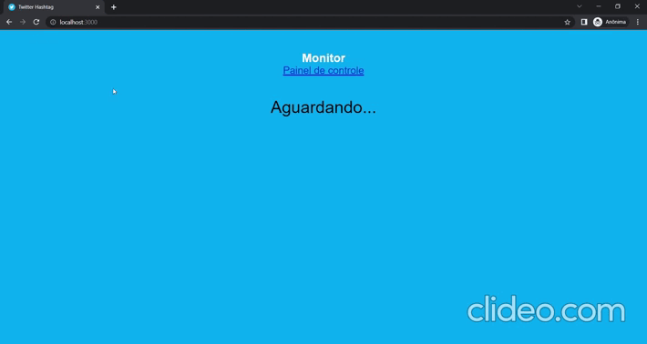

## Sobre

Aplicação para monitoramento de determinada hashtag no Twitter, para ser aceito ou não e ser exibido em um monitor.

- Dados atualizados em tempo real.




## Funcionalidades

- Tela principal:

  - Só serão mostrados os tweets que forem aceitos.

- Painel de Controle:

  - Ao digitar uma hashtag e monitorar, serão exibidas em tempo real suas respectivas postagens do Twitter.

  - Os tweets monitorados serão exibios na coluna 'Tweets Recebidos'.

  - Os tweets aprovados serão exibios na coluna 'Tweets Aprovados'.

    - Tweets recebidos serão mostrados em tempo real na 'Tela Principal'.
    - Tweets recebidos podem ser Reprovados clicando no respectivo botão na parte superior do tweet.

  - Os tweets reprovados serão exibidos na coluna 'Tweets Reprovados'.

    - Tweets reprovados podem ser Aprovados clicando no respectivo botão na parte superior do tweet.

## Começando

### Pré-requisitos

Para executar este projeto no modo de desenvolvimento, você precisará de um ambiente básico para executar um aplicativo React.JS, que pode ser encontrado [aqui](https://reactjs.org/docs/getting-started.html).

Além disso, você precisará do servidor em execução localmente em sua máquina. Você pode encontrar o servidor e todas as instruções para iniciar o servidor [aqui](https://github.com/alexjou/get_tweets).

### Instalando

**Clonando o Repositório**

```
$ git clone https://github.com/alexjou/show_tweets

$ cd show_tweets
```

**Instalando dependências**

```
$ yarn
```

_ou_

```
$ npm install
```

### Conectando o aplicativo ao servidor

1 - Siga as instruções no servidor [get_tweets](https://github.com/alexjou/get_tweets) para que o servidor esteja sendo executado em sua máquina.

2 - Com o servidor em funcionamento, acesse o arquivo [src / configs / api.js](https://github.com/alexjou/show_tweets/blob/master/src/configs/defaultConfig.js) e edite o valor do campo baseURL (linha 2) com o IP da sua máquina, exemplo _http://localhost:3333_.

### Rodando a aplicação

Com todas as dependências instaladas e o ambiente configurado corretamente, agora você pode executar o aplicativo:

```
$ yarn start
```
